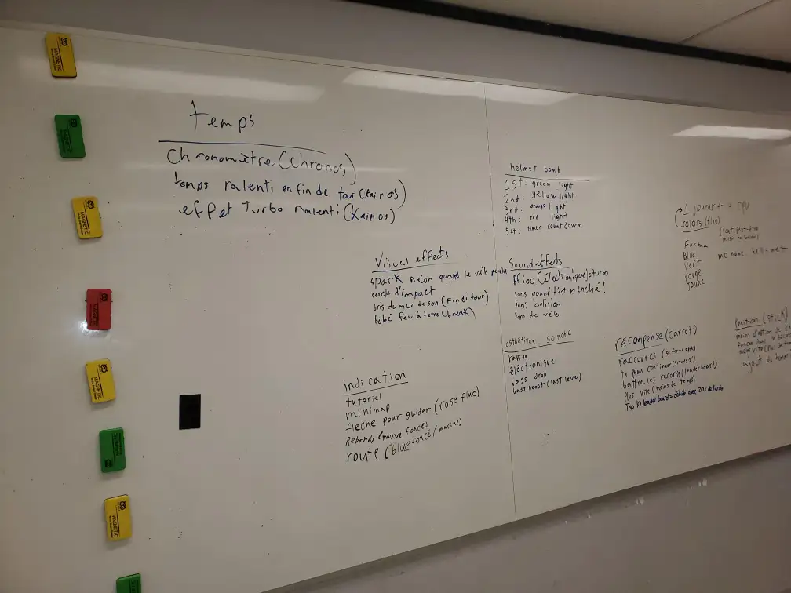
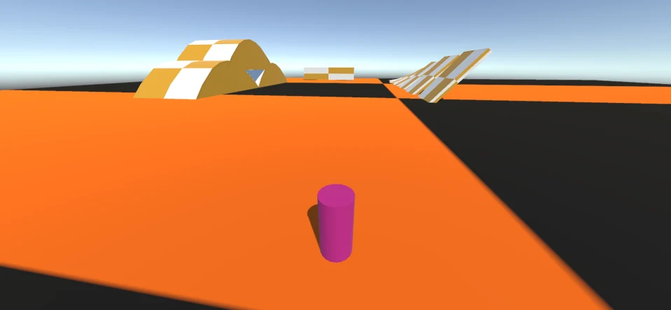
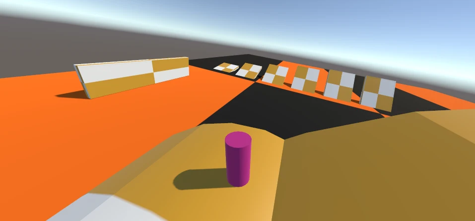
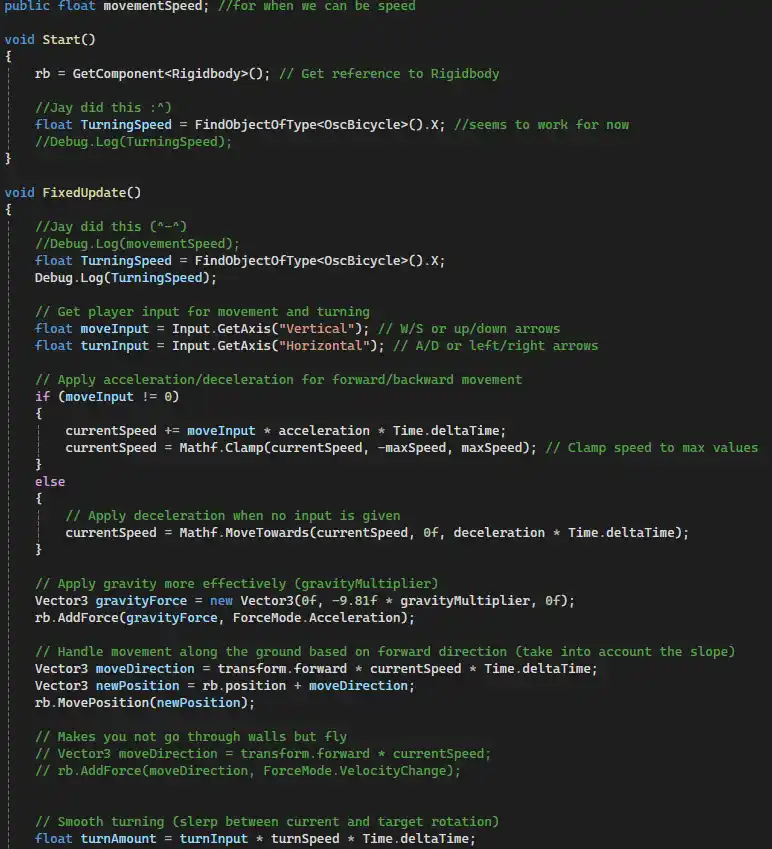
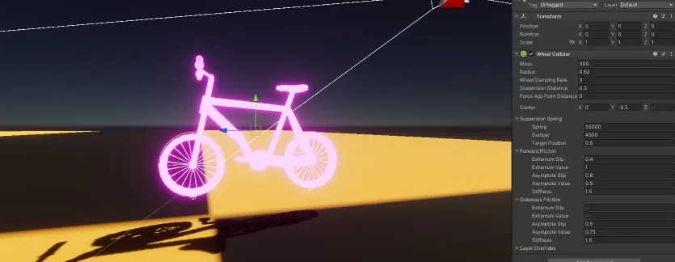
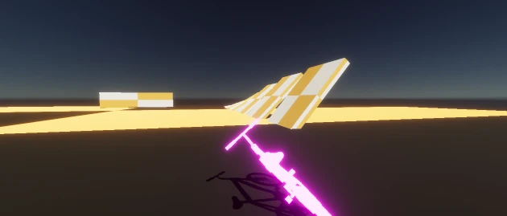
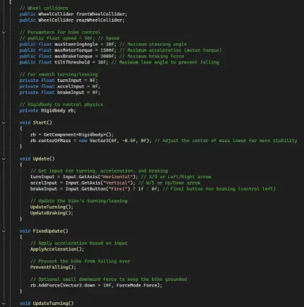

# Alexandre Gervais

Je suis le programmeur des méchaniques dans l'engin de jeu Unity. Je m'occupe des movements de base du jeu comme pouvoir tourner à horizontalement et avancer vers l'avant. Je suis également le responsable des méchaniques centrales comme le turbo permettant à l'utilisateur de rattraper la compétition. Parlant de la compétition, moi et Ian Corbin sont responsables de fonctionnement interne du movement des AI qui défient l'utilisateur.

 ## Réalisations
 <!-- Une image par semaine de la réalisation dont tu es le plus fier avec une légende -->
### Semaine 1
Pour la première semaine de travail, mon équipe et moi on rafiné le concept du jeu et ses méchaniques pour s'assurer que notre projet soit unique, créatif et amusant.

### Semaine 2
Durant notre deuxième semaine de travail, j'ai programmé un système de mouvement de base qui est fonctionnel, mais qui a divers problèmes, surtout rapport avec les physiques du vélo. 

J'ai essayé divers manières et rechercher comment améliorer mon système et ce que j'ai trouvé est que le système au complet n'est pas super car il est fait autour des principes liés à la composante Rigidbody, typiquement utilisée pour simuler les physiques et la mass, aulieu de quelque chose plus similair à un véhicule.

### Semaine 3
Pour cette semaine, mon objectif était de faire que le vélo se contrôle bien et est satisfaisant à controller. Je visais à atteindre ceci avec ma nouvelle approche pour simuler les physiques d'un vélo, utiliser des wheel colliders. Ceci est une composante de base dans l'engin Unity qui a différent attributs qui vise à simuler une voiture, donc mon but était de modifier les wheels colliders pour se rapprocher à des physiques de vélo plutôt que de voiture.

De plus, j'ai changé le système de caméra pour le système cinemachine, qui offre une caméra plus dynamique qui met l'accent sur la vitesse et les virages.

Finalement, j'ai refait le code de movement pour se centrer autour des Wheel Colliders aulieu du Rigidbody avec des fonctions pour chaque actions. Il y a quelques problèmes comme la friction trop glissante, la vitesse du vélo est lente et, une fois un virage fait, le vélo pendule entre faire une rotation z vers la gauche et la droite à l'infini.

