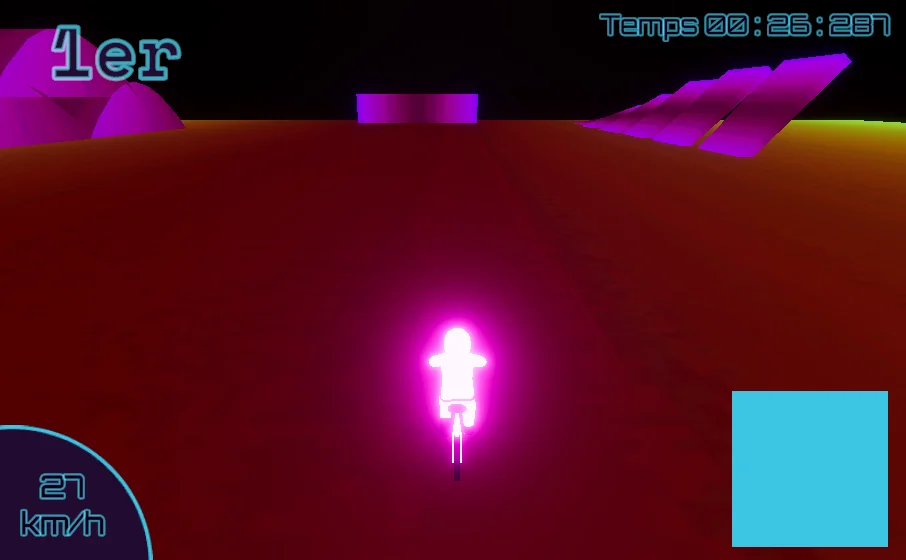

# Alexandre Gervais

Je suis le programmeur des méchaniques dans l'engin de jeu Unity. Je m'occupe des movements de base du jeu comme pouvoir tourner à horizontalement et avancer vers l'avant. Je suis également le responsable des méchaniques centrales comme le turbo permettant à l'utilisateur de rattraper la compétition. Parlant de la compétition, moi et Ian Corbin sont responsables de fonctionnement interne du movement des AI qui défient l'utilisateur.

 ## Réalisations
 <!-- Une image par semaine de la réalisation dont tu es le plus fier avec une légende -->
### Semaine 1
Pour la première semaine de travail, mon équipe et moi on rafiné le concept du jeu et ses méchaniques pour s'assurer que notre projet soit unique, créatif et amusant.

### Semaine 2
Durant notre deuxième semaine de travail, j'ai programmé un système de mouvement de base qui est fonctionnel, mais qui a divers problèmes, surtout rapport avec les physiques du vélo. 

J'ai essayé divers manières et rechercher comment améliorer mon système et ce que j'ai trouvé est que le système au complet n'est pas super car il est fait autour des principes liés à la composante [Rigidbody](https://docs.unity3d.com/6000.0/Documentation/ScriptReference/Rigidbody.html), typiquement utilisée pour simuler les physiques et la mass, aulieu de quelque chose plus similair à un véhicule.

### Semaine 3
Pour cette semaine, mon objectif était de faire que le vélo se contrôle bien et est satisfaisant à controller. Je visais à atteindre ceci avec ma nouvelle approche pour simuler les physiques d'un vélo, utiliser des [wheel colliders](https://docs.unity3d.com/Manual/class-WheelCollider.html). Ceci est une composante de base dans l'engin Unity qui a différent attributs qui vise à simuler une voiture, donc mon but était de modifier les wheels colliders pour se rapprocher à des physiques de vélo plutôt que de voiture.

De plus, j'ai changé le système de caméra pour le système [cinemachine](https://unity.com/fr/features/cinemachine), qui offre une caméra plus dynamique qui met l'accent sur la vitesse et les virages.

Finalement, j'ai refait le code de movement pour se centrer autour des Wheel Colliders aulieu du Rigidbody avec des fonctions pour chaque actions. Il y a quelques problèmes comme la friction trop glissante, la vitesse du vélo est lente et, une fois un virage fait, le vélo pendule entre faire une rotation z vers la gauche et la droite à l'infini.

### Semaine 4
Mon objectif pour cette semaine était de complèter le plus de petites parties que je pouvais telle que faire que le UI soit dynamique et améliorer ma scène Unity de tests pour tester les mouvements dans le but de pouvoir donner du feedback à mon équipe.

Pour le UI, j'ai ajouté une composante script à notre canvas et j'ai codé ce qui était nécessaire pour connecter divers intéractions (telle que le positionnement du joueur, sa vitesse et le temps épuisé) à l'interface dans le but de le rendre dynamique.

De plus, j'ai programmé un compte à rebours au début de la course pour donner à l'utilisateur du temps pour comprendre ce qui est attendu de lui.

### Semaine 5
Pour cette semaine, mon objectif était de simplifier l'interface de l'utilisateur en enlevant tout, puis ajouter des icônes pour représenter le temps restant pour chacun joueur d'une manière intuitive.

J'ai fait plusieurs versions de la représentations des joueurs comme celle-ci :

Ceci est la version dont on planifie utiliser :

Le portrait des personnages baisse grandement en opacité une fois que le personnage est éliminé, mais le fusible de bombe ne se réduit pas encore pour représenter le temps restant pour les joueurs.

### Semaine 6
Pour cette semaine, j'ai améliorer de plus le UI en ajoutant une animation pour représenter le fusible qui se réduit quand un joueur est en dernière place.

J'ai également fait en sorte que les portraits des personnages sont dans le même ordre que leur positionnements respectifs (exemple si le joueur rouge est en première place, son portrait sera tout en haut)

Finalement, avec la rétroaction reçue par les étudiants qui sont venus visiter nos projets, on a décidé d'ajouter des objets pour faire que notre oeuvre soit plus complète et engageante avec l'utilisateur. J'ai écris et dessiné des concepts pour des objets potentiels qu'on va ajouter à notre jeu.

### Semaine de rattrapage
Durant cette semaine, j'ai majoritairement travaillé avec mon comité de web, mais sur ce projet, j'ai fait la base pour préparer l'intégration du tutoriel à notre projet et j'ai fait des animations de UI pour le tutoriel.

### Semaine 7
Pour notre dernière semaine de développement, j'ai réalisé toutes sortes de divers choses. Premièrement, j'ai fait une animation d'étincelles pour le fil de bombe dans le UI et une animation qui affiche la mort également dans le UI. J'ai codé les 3 niveaux courts de tutoriels qui ont une animation de confirmation de la réussite de l'étape du tutoriel et fait, avec l'aide de Samuel, les modèles 3D qui les décores.

Pour aider avec la vitesse des tests de mon équipe, j'ai codé un menu Debug pour rapidement changer entre niveaux. De plus, j'ai codé la scène intro qui joue quand aucun joueur n'est présent où la caméra change dynamiquement d'angle entre les 5 AI qui naviguent infiniment la piste. Ce code de changement dynamique de caméra à été également utilisé dans la scène qui joue quand l'oeuvre est terminée. Par la suite, j'ai ajouté des icônes qui aident avec la compréhension de l'ordre dans le UI.

Finalement, j'ai fait le montage vidéo de la bande d'annonce de notre projet.

### Semaine 8
J'ai fait le montage et tournage du «Making Of».

