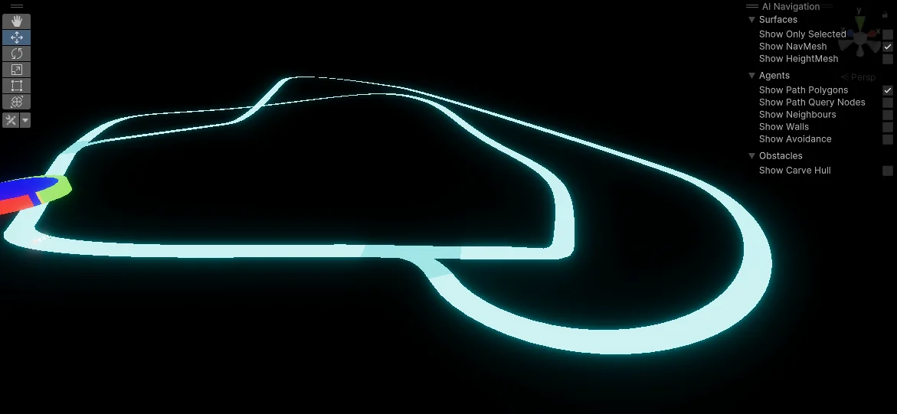
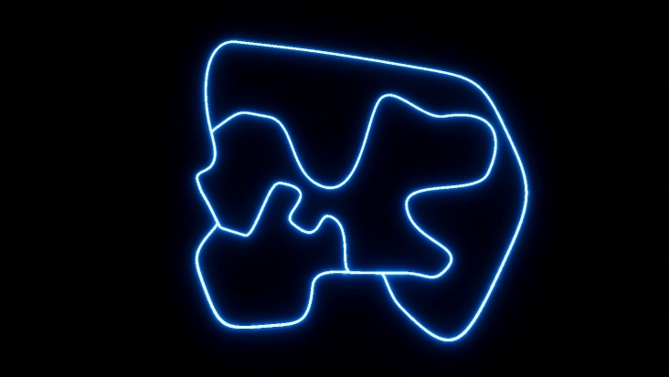
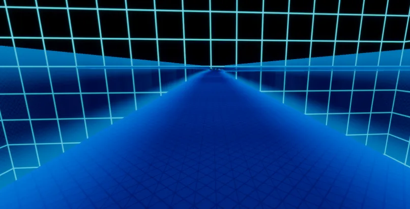
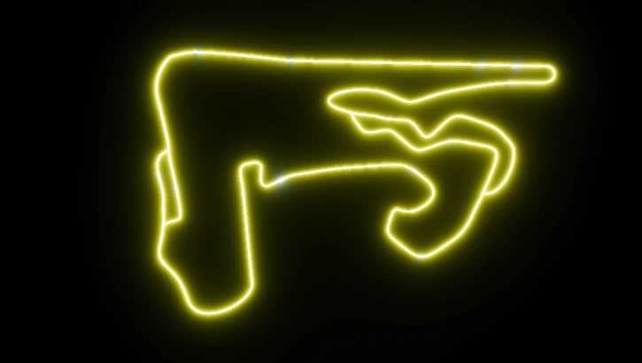
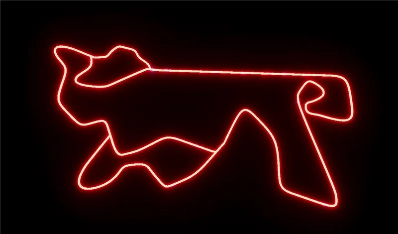

# Ian Corbin

 
 [Portfolio](https://ianqc.github.io/Corbin_Ian_Portfolio)

 ## Réalisations

### Semaine 1
Pour la première semaine, j'ai trouvé comment faire le circuit du jeu ainsi que commencé une texture test.

 
 
 
### Semaine 2
Pour la deuxième semaine, j'ai commencé l'intégration du circuit avec le système de création de routes.
  
  
  
### Semaine 3
Pour la troisième semaine, j'ai complètement refait notre projet Unity jusqu'à présent afin de changer notre projet de render pipeline à HDRP. J'ai aussi rajouté des murs à la piste et j'ai créé une première piste complète.
 
 
 

### Semaine 4
Pour la quatrième semaine, j'ai intégré les ennemis au circuit et je leur ai donné un système d'IA de Navigation Pathfinder afin de leur faire suivre le circuit au complet. J'ai aussi fait des VFX, comme les trails derrière le vélo.
 

 ### Semaine 5
Pour la cinquième semaine, j'ai créer une nouvelle intersection pour la piste et j'ai refait la majorité du code pour le controle du joueur afin de créer une expérience plus fluide.
 

 ### Semaine 6 
 Pour la sixième semaine, j'ai créer la premiere vrai piste du jeux, j'ai aussi créer le turbo pour le vélo et améliorer la trail vfx du vélo.

 
 
 ### Semaine de Ratrapage
 J'ai commencer a créer des des effets visuels, améliorer des textures, réparer des UV et créer la texture du mur du circuit.
 
Image à ajouté

 ### Semaine 7
 Pour la septième semaine, j'ai créer les nouvelles pistes, créer des textures et régler des problèmes.

 
 
