# Jérémy Roy-Coté

 
[Portfolio](https://madkingside.github.io)

Je suis le programmeur d'interconnectivité du jeu C0N DU8. J'ai pour rôle de détecter les intéractions du joueur avec la Kinect et les boutons et d'envoyer les données entre les logiciels Touchdesigner, Arduino IDE et Unity. De plus, Je gere le détection du joueur et l'exclusion des personnes autre que le joueur qui sont vue par la Kinect.

 ## Réalisations

### Semaine 1

La première semaine, j'ai conceptualisé la manière que les boutons seraient lié au vélo stationnaire.

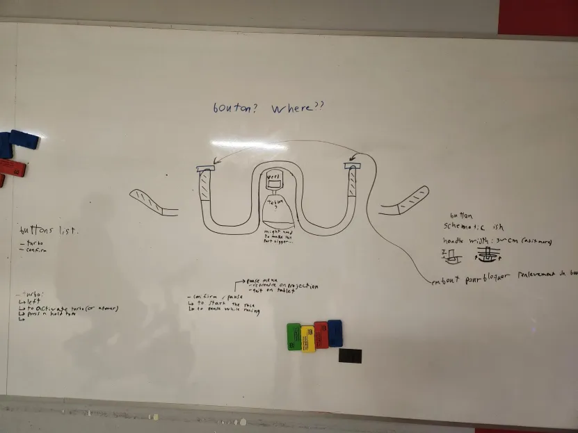

Moi et mon équipe avons ensuite fini de solidifier notre approche sur comment faire le jeu.

je me suis ensuite attardé sur la détection du joueur avec la Kinect et l'envois des données vers Unity.

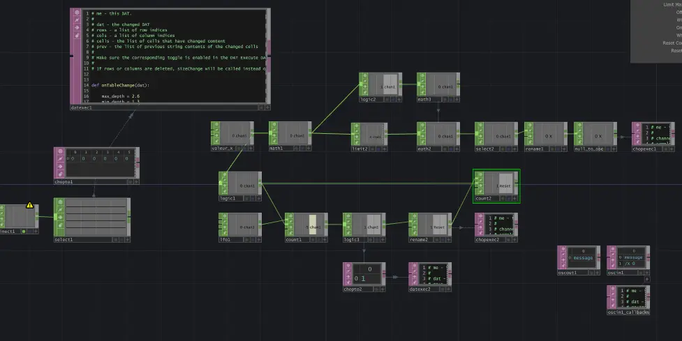

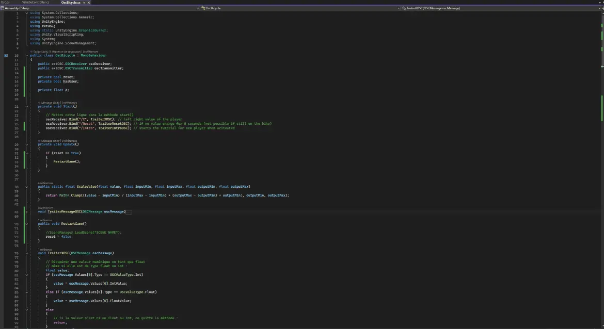

### Semaine 2

La deuxième semaine j'ai établit la connection entre Arduino IDE et Unity pour permettre la réception des données venant des boutons.

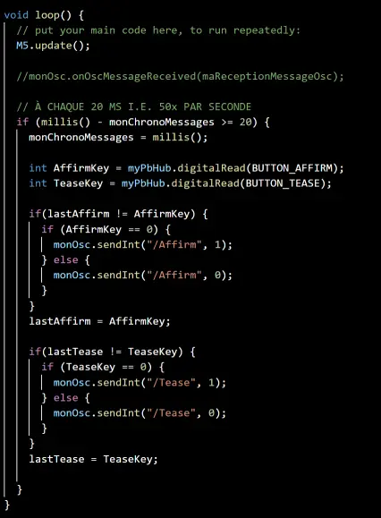

J'ai ensuite reglé le problème de détection du joueur quand il y a plusieur personnes dans le champ de vision de la Kinect. Le code passe a travers toutes les personnes et choisi seulement la personne sur le vélo stationnaire.

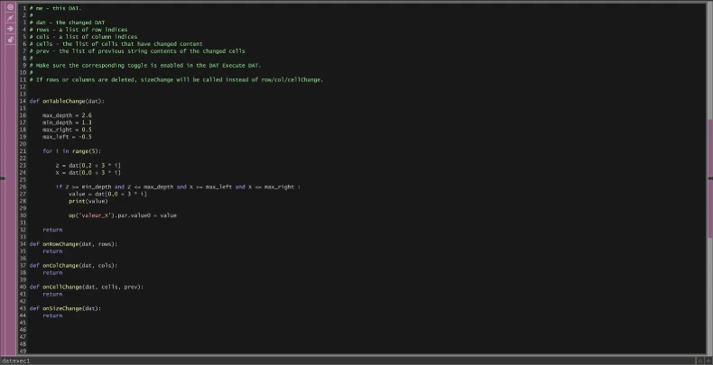

Le code si dessous permet de recommencer le jeu si le joueur quitte la zone.

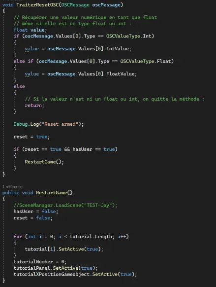

### Semaine 3

La troisième semaine j'ai continué de peaufiner le code Touchdesigner pour maintenant permettre à chaque joueur de calibrer la sensibilité de la détection de leurs mouvements.

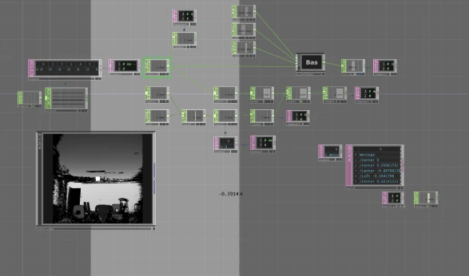

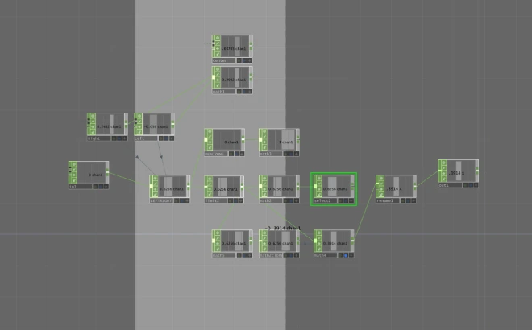

J'ai aussi ajouté un début de tutoriel dans unity pour permettre au joueur de comprendre comment calibrer leur sensibilité.

### Semaine 4

La quatrième semaine j'ai finalement reçu le voltmètre pour faire fonctionner les pédales avec le jeu. J'ai fait le code et le liens correspondant au voltmètre dans Arduino et Unity. 

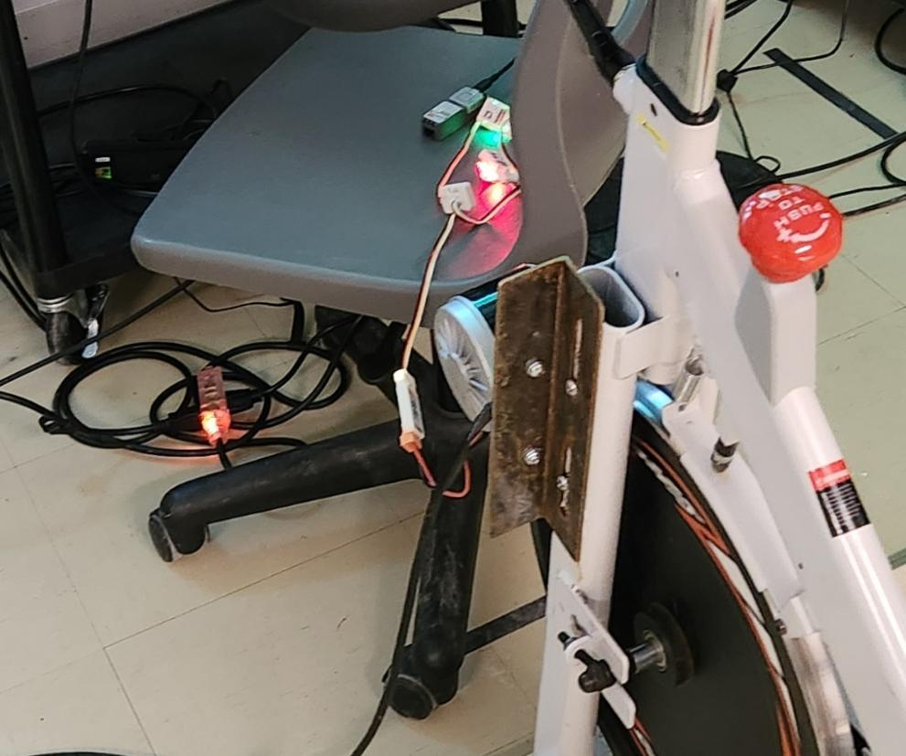

J'ai ensuite fait un le code dans Unity permettant de savoir la position de de chaque participant de la course pour ensuite pouvoir les éliminer quand il sont en dernière place.

### Semaine 5

La cinqième semaine j'ai fait un script python dans Touchdesigner pour prendre en compte le milieu de la calibration.

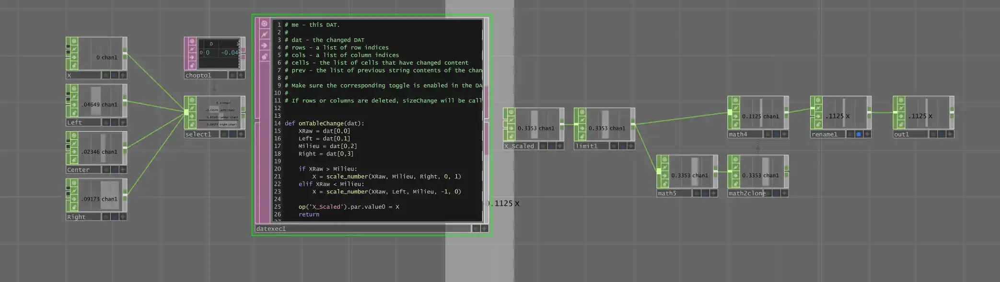

J'ai continuer ma semaine en travaillant sur le script de l'AI pour leur permettre de choisir un chemin different quand il y à plusieurs chemin de disponible.

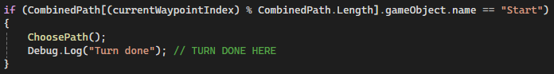
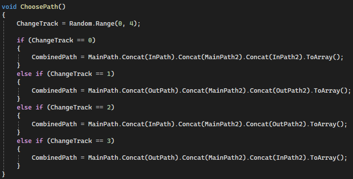

### Semaine 6

La sixième semaine j'ai amélioré le script principal pour le joueur et les AI pour qu'il se penchent en tournant.

J'ai aussi commencé le « Rubber Banding » pour les AI pour qu'il puissent rattraper le joueur plus facilement.

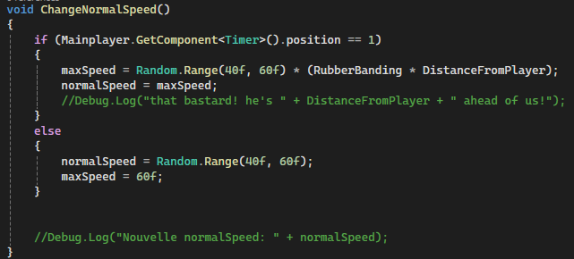

J'ai fini par créer des encoche dans les planches de bois pour aider la stabilisation du vélo stationnaire.

### Semaine 7

Pour la dernière semaine, j'ai amélioré le code pour quand quelqu'un rentre dans la zone et sort de la zone. J'ai aussi fait le liens entre les scenes (les courses).

J'ai ensuite testé pour voir s'il y avait des erreurs et je me suis assuré que tout fonctionnait correctement.

J'ai fini par améliorer le 《 rubberbanding 》sur les AI pour qu'ils aillent plus vite quand le joueur est plus loin qu'eux.