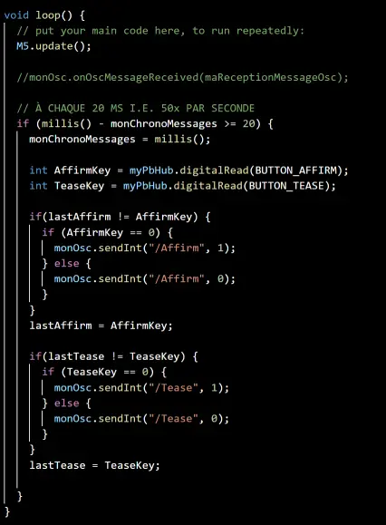
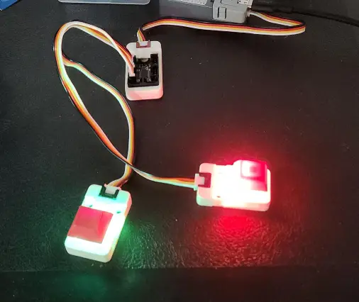
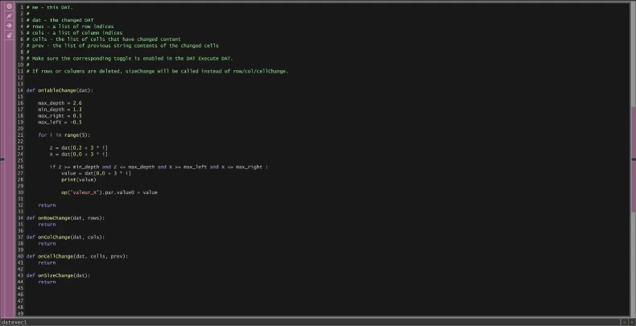
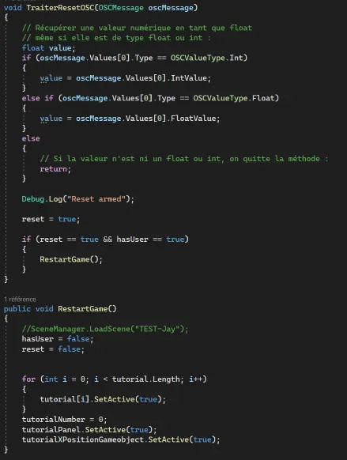
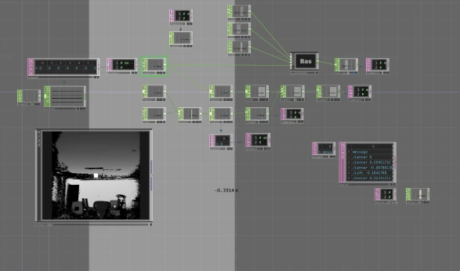
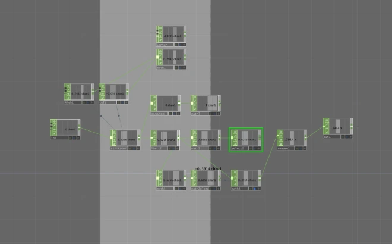

# Jérémy Roy-Coté

 

Je suis le programmeur d'interconnectivité du jeu C0N DU8. J'ai pour rôle de détecter les intéractions du joueur avec la Kinect et les boutons et d'envoyer les données entre les logiciels Touchdesigner, Arduino IDE et Unity. De plus, Je gere le détection du joueur et l'exclusion des personnes autre que le joueur qui sont vue par la Kinect.

 ## Réalisations

### Semaine 1

La première semaine, j'ai conceptualisé la manière que les boutons seraient lié au vélo stationnaire.

Moi et mon équipe avons ensuite fini de solidifier notre approche sur comment faire le jeu.

je me suis ensuite attardé sur la détection du joueur avec la Kinect et l'envois des données vers Unity.

### Semaine 2

La deuxième semaine j'ai établit la connection entre Arduino IDE et Unity pour permettre la réception des données venant des boutons.

J'ai ensuite reglé le problème de détection du joueur quand il y a plusieur personnes dans le champ de vision de la Kinect. Le code passe a travers toutes les personnes et choisi seulement la personne sur le vélo stationnaire.

Le code si dessous permet de recommencer le jeu si le joueur quitte la zone.

### Semaine 3

La troisième semaine j'ai continué de peaufiner le code Touchdesigner pour maintenant permettre à chaque joueur de calibrer la sensibilité de la détection de leurs mouvements.

J'ai aussi ajouté un début de tutoriel dans unity pour permettre au joueur de comprendre comment calibrer leur sensibilité.

