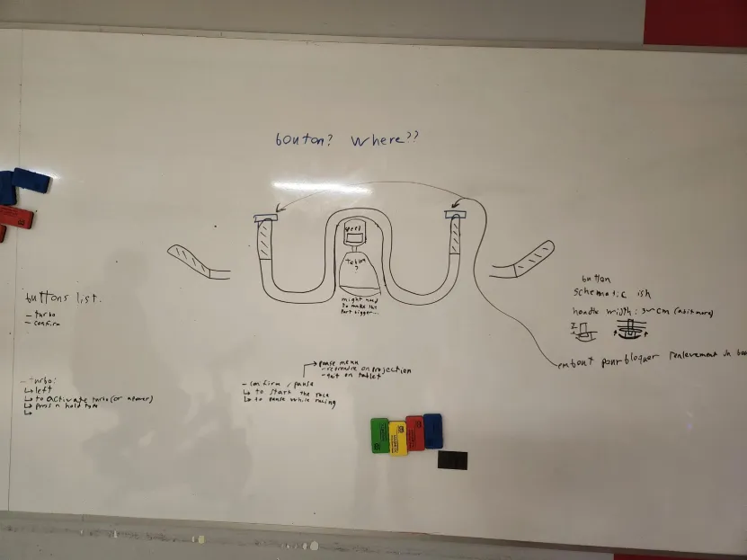
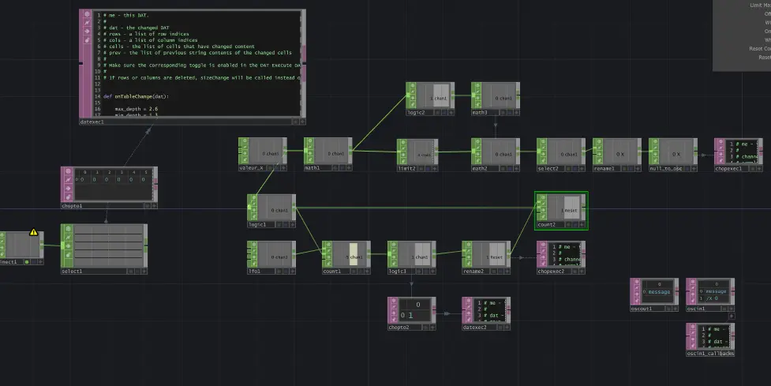
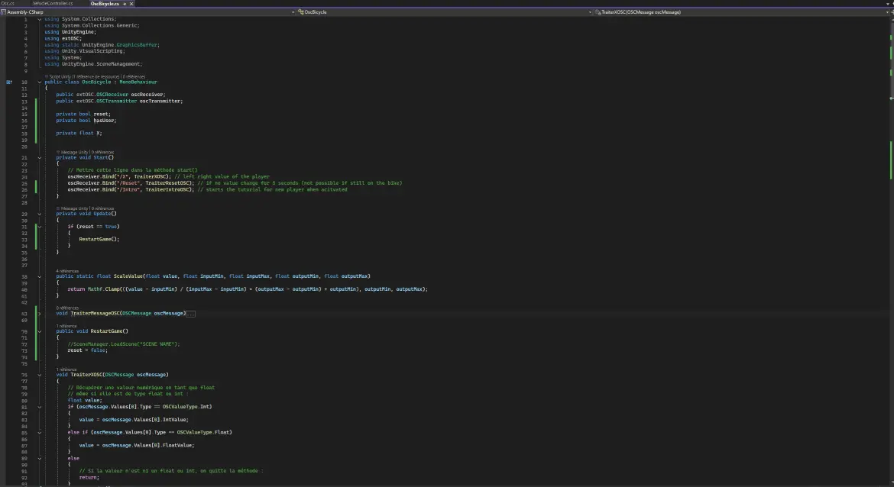
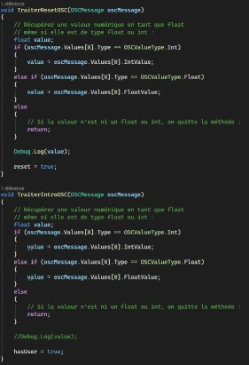

# Jérémy Roy-Coté

 

Je suis le programmeur d'interconnectivité du jeu C0N DU8. J'ai pour rôle de détecter les intéractions du joueur avec la Kinect et les boutons et d'envoyer les données entre les logiciels Touchdesigner, Arduino IDE et Unity. De plus, Je gere le détection du joueur et l'exclusion des personnes autre que le joueur qui sont vue par la Kinect.

 ## Réalisations

### Semaine 1

La première semaine, j'ai conceptualisé la manière que les boutons seraient lié au vélo stationnaire.

Moi et mon équipe avons ensuite fini de solidifier notre approche sur comment faire le jeu.

je me suis ensuite attardé sur la détection du joueur avec la Kinect et l'envois des données vers Unity.

### Semaine 2

### Semaine 3

### Semaine 4
 <!-- Une image par semaine de la réalisation dont tu es le plus fier avec une légende -->

* 
