# Keven Malric

 

## Rôle

 Je suis le responsable des média vidéo de l’équipe Gearshift Games. 

 

Je prends en charge la réalisation des vidéos informatives. 

 

Je suis donc en charge la réalisation de cette vidéo d’intention, ainsi que la vidéo promotionnelle du projet CON-DU8.  

 

J’ai également le rôle de responsable du déploiement technique. 

 

J'ai donc la responsabilité de déployer l’installation de façon sécuritaire incluant la gestion des câbles ainsi que l’intégrité de l’équipement. 

 

Prendre en compte les risques liées à la position, la durabilité ainsi que les possibles modifications physiques de l’œuvre, seront des enjeux que je devrais évaluer. 

## Réalisations

 <!-- Une image par semaine de la réalisation dont tu es le plus fier avec une légende -->
### semaine 1

 j'ai révisé le concepte du projet au point de vue des effets sonnores et du déploiement technique.

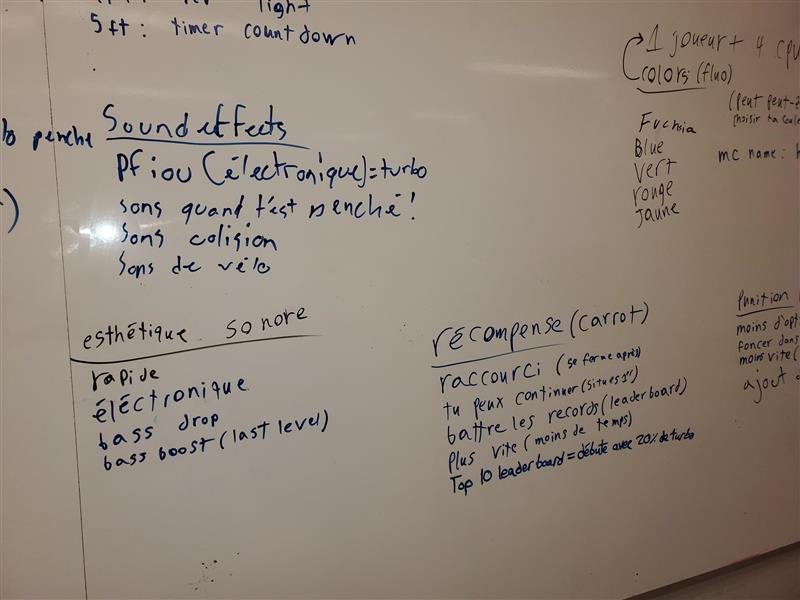

### semaine 2

 j'ai édité et filmé la vidéo d'intention avec l'aide du petit studio et du logiciel Reaper et Davinci.

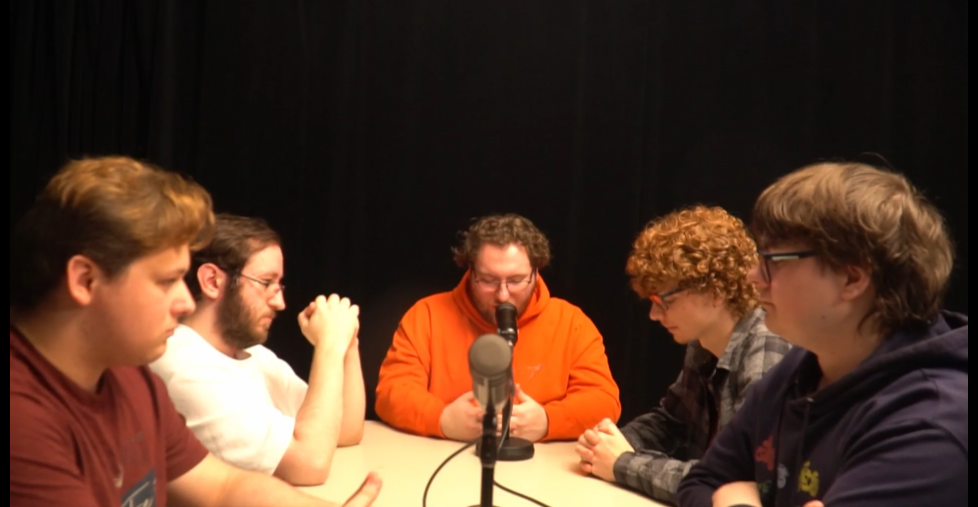

### semaine 3

 j'ai refait une vidéo d'intention avec, cette fois-ci des images et des animations et une melleur qualité sonore, J'ai pris les mesures de la zone qui nous est attitrée afin de bien placé l'équipement dans l'environnement et j'ai crée un shémat tachnique avec ces mesures, dans le logiciel Inkscape.

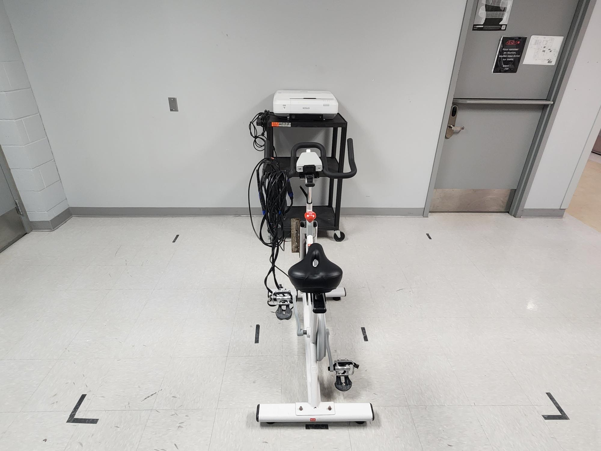

### semaine 4 
 j'ai enregistré et fait le montage de tous les efftets sonore nécessaire au bon foctionnement du jeux, 
 j'ai modifié le vélo pour le rendre plus stable puis j'ai changé la roue afin qu'elle vacille moin et soit moin bruillante.

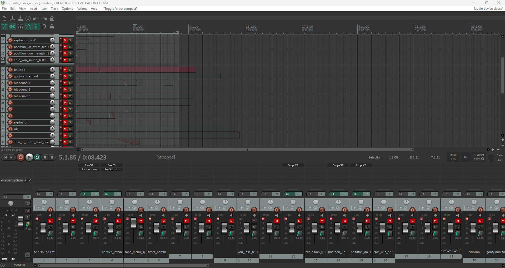

### semaine 5 
j'ai passé la pluspart de la semaine à créer 10 variations pour chaque son créé 
la semaine passé. 

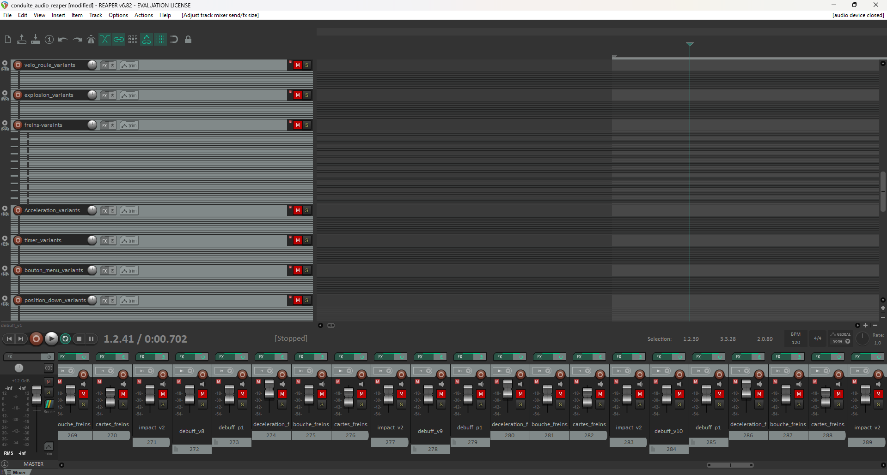

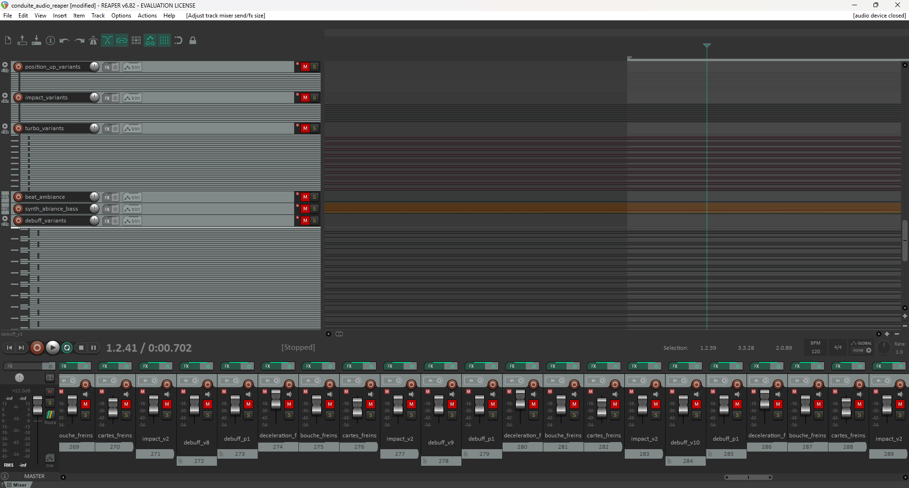

### semaine 6 
j'ai passé la pluspart de la semaine à crée l'ambiance sonnore du jeu (la musique). 

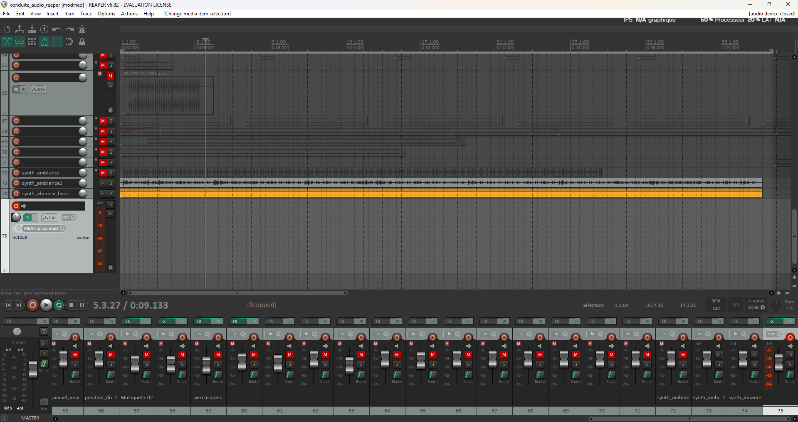

 De plus, j'ai crée des textures pour les pistes de courses. 

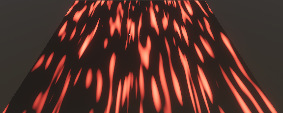

|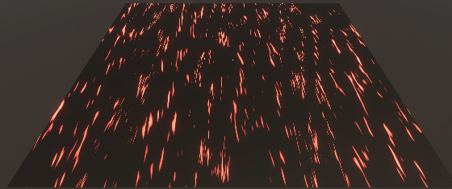|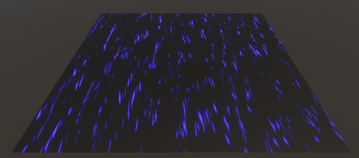|
|-----|-----|

|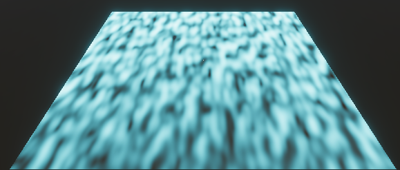|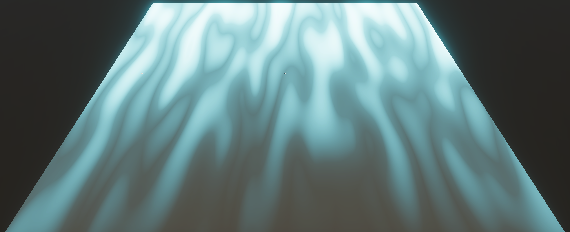|
|-----|-----|

### semaine de rattrapage 
j'ai paint le vélo en rose et j'ai vernis les planches qui seront  
utilisées au vernissage pour sécuriser les mouvements du vélos.

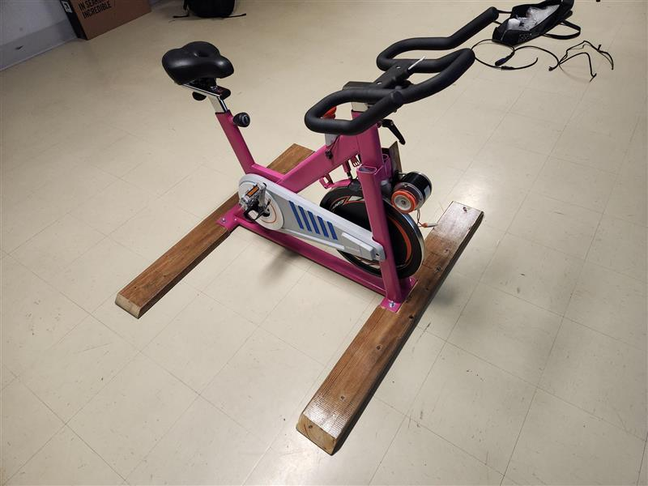

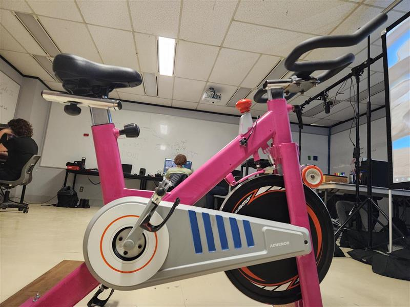

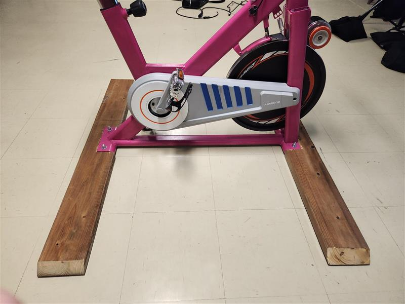

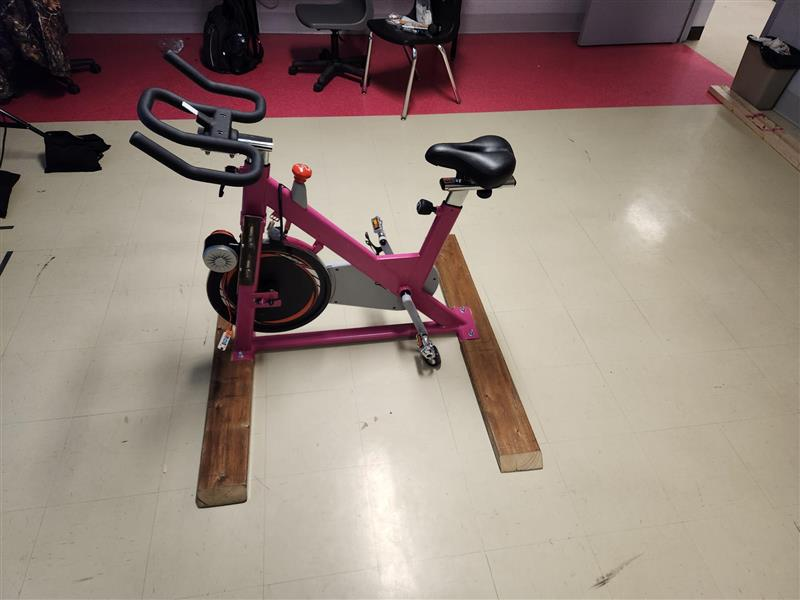

 

   

 
