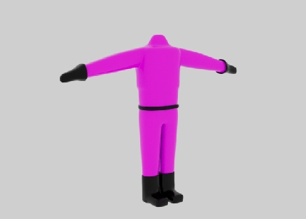

# Samuel Desmeules-Voyer 

Je suis directeur artistique et artiste 3D en chef pour le projet C0NDU8. Mon rôle consiste à créer l'identidé visuelle du jeu à travers les logos, l'interface utilisateur, modéliser les personages et objets en 3d, les animer et les intégrer dans unity. Mon but est que C0NDU8 se démarque avec une identité visuelle intéressante.

 ## Réalisations

 <!-- Une image par semaine de la réalisation dont tu es le plus fier avec une légende -->

 ### Semaine 1
 La première semaine était en majorité dédiée à la clarification du concept de C0N DU8 mais j'ai aussi pu commencer à dessiner des concepts pour l'interface utilisateur et travailler sur mon premier modèle 3D: Le vélo.

 ### Semaine 2
 Pour la deuxième semaine, le concept du jeu était largement aprouvé donc j'ai pu me concentrer sur la modélisation du personnage principal.

 ### Semaine 3
Ma troisième semaine à été passée presque entièrement à faire le logo de Conduite. J'ai aussi finalisé la modèle du personnage principal, ses textures et son squelette pour finalement l'intégrer dans Unity.

 ### Semaine 4

* 
