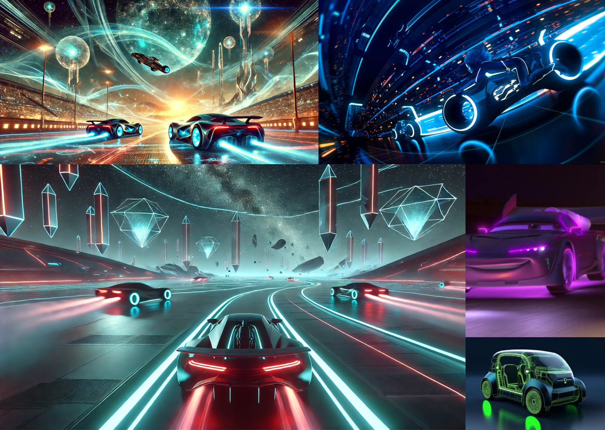

# Ambiance

<!-- Ici mettre tous les documents et références associés à l'établissement de l'ambiance du projet   -->

## Références

### moodboard ambiance visuelle:

https://www.youtube.com/watch?v=Ub-VoLqGcx8  
https://www.youtube.com/watch?v=ODFY81dDpjQ
[Ambiance](https://tim-montmorency.com/582523-gestion/#/contenus/2_scenarisation/30_ambiances/)
