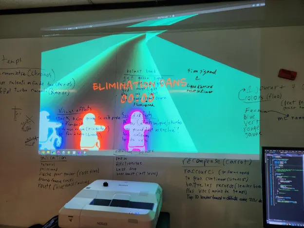

# Maquette

Documentation de la maquette, son fonctionnement, ce qu'elle teste et le résultat de ce test.

La maquette sert de base pour notre oeuvre. Elle permet de tester tous les méchaniques nécessaires à notre oeuvre comme pédaler pour avancer dans le jeu et tourner de gauche à droite pour naviguer les circuits. Cette base nous permet d'accélerer le tempo sur le développement de l'oeuvre et de la peaufiner en ajoutant des choses comme des éléments de décors en arrière-plan, un UI retravaillé, plusieurs circuits différents et des contrôles plus satisfaisant.

## Gallerie d'images

* 
* 
* 
* 
* 

## Vidéo de la maquette en action

<!--
## Références 

* [Étude de faisabilité](https://tim-montmorency.com/582523-gestion/#/contenus/4_faisabilite/10_etude/)
* [Maquette](https://tim-montmorency.com/582523-gestion/#/contenus/4_faisabilite/30_maquette/)
>
