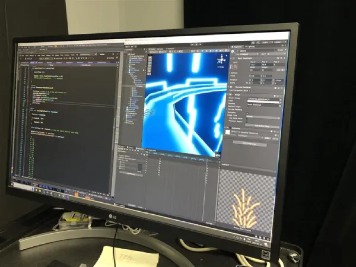

# Diffusion

Documentation du projet finalisé 

* Vidéo 
  * Making of
 

  * Vidéo d'intention
    
 

## Instruction d'utilisation

##### 1: Entrez dans la zone de jeux et installez-vous sur le vélo stationnaire.

##### 2: Commencez à pédaler et effectuez les 3 tutoriels interactifs.

##### 3: Pédalez comme si votre vie en dépendait et rendez-vous le plus loin possible dans le jeu.

##### 4: Après avoir fini la dernière course, vous pouvez rester dans la zone et attendre que le jeu recommence ou vous pouvez quitter la zone de jeu.

## Manuel d'instruction pour l'opération

##### 1: Lancer le fichier « bicyc.toe » sur TouchDesigner (Le pull de github au besoin) 

##### 2: Lancer projet « HellRider » sur Unity (Le pull de github au besoin) et ouvrir la scène « INTRO »

##### 3: Lancer OBS, clique droit sur le rendu et envoyer la projection vers le projecteur  
 
 

##### 4: Débutez la scène intro pour commencer le jeu  

## Fonctionnement du projet

##### 1: En pédalant, le vélo envoie des données OSC vers TouchDesigner qui les envoie par la suite à Unity.

##### 2: Unity reçoit les données de la Kinect et du vélo depuis TouchDesigner afin de les utiliser comme données de vitesse, de rotation ainsi que de détection.

##### 3: Au lancement de la scène d'Intro, une vidéo de gameplay est jouée en boucle jusqu'à ce qu'un utilisateur entre dans la zone de détection de la Kinect.

##### 4: Quand un tutoriel est réussi, le prochain tutoriel est lancé jusqu'à ce que chacun d'entre eux soit complété.

##### 5: Suite à la complétion des 3 tutoriels, la première course est automatiquement lancée.

##### 6: Si un joueur perd, il reprend au premier circuit peu importe son progrès.

##### 7: Après avoir complété toutes les courses, la scène d'Outro est lancée.

##### 8: Dans la scène d'Outro, l'utilisateur a le choix entre quitter l'installation ou rester dans la zone de détection et recommencer.

##### 9: Si le joueur reste un total de 10 secondes, le jeu recommencera à partir du premier circuit.

##### 10: Si le joueur quitte la zone pendant plus de 3 secondes, le jeu reviendra automatiquement à la scène d'introduction (cette étape est valable durant l'intégralité de l'expérience).

## Disposition de l'expérience

